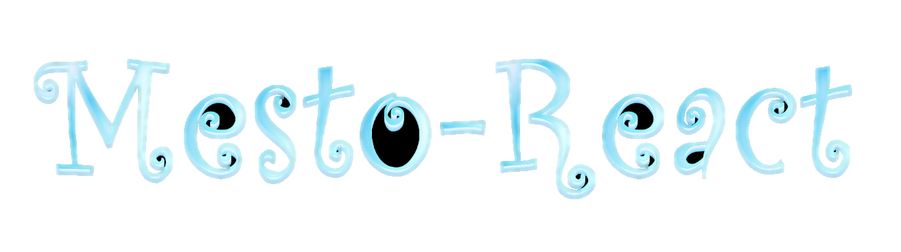

<h2 align="center">Привет, будем знакомиться - я Марина
</h2>
<h3 margin="0" align="center">И я начинающий  frontend developer</h3>

~~~~~~~~~~

 
 - :mortar_board: В настоящее время учусь на курсе Яндекс.Практика
 - :mag_right:  Изучаю CSS, HTML, JavaScript, React. Знакомлюсь с Figma, GIT, GitHub, Webpack
 - :memo: Создаю учебные проекты, применяя БЭМ, ООП, адаптив, API
 - :eyes: Все проекты проходят ревью
 - :thumbsup:  Уже не терпится поработать в команде над реальным, "живым" проектом
 - :grey_question: Хочу глубже вникнуть в работу React
 - :sparkles: Уверена, со временем научусь писать лаконичный и чистый код
 - :muscle:  А пока повторяю, перечитываю, решаю задачки  
 - :point_right: Мое [резюме](https://hh.ru/resume/048cbf53ff0aeb96920039ed1f463436654b46)
 - :dancer: В свободное время живу, люблю и дарю йогу, гуляю со своей собакой и творю руками красоту
 

~~~~~~~~~~

 

### :hammer: Языки и инструменты: 

 
 
 
 
 
 

~~~~~~~~~~

### :bar_chart: Статистика: 
 

~~~~~~~~~~

 ### :pushpin: Проекты на курсе Яндекс.Практика: 

~~~~~~~~~~
